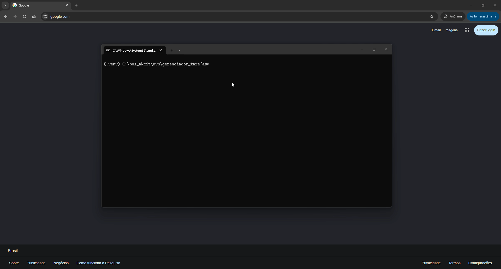
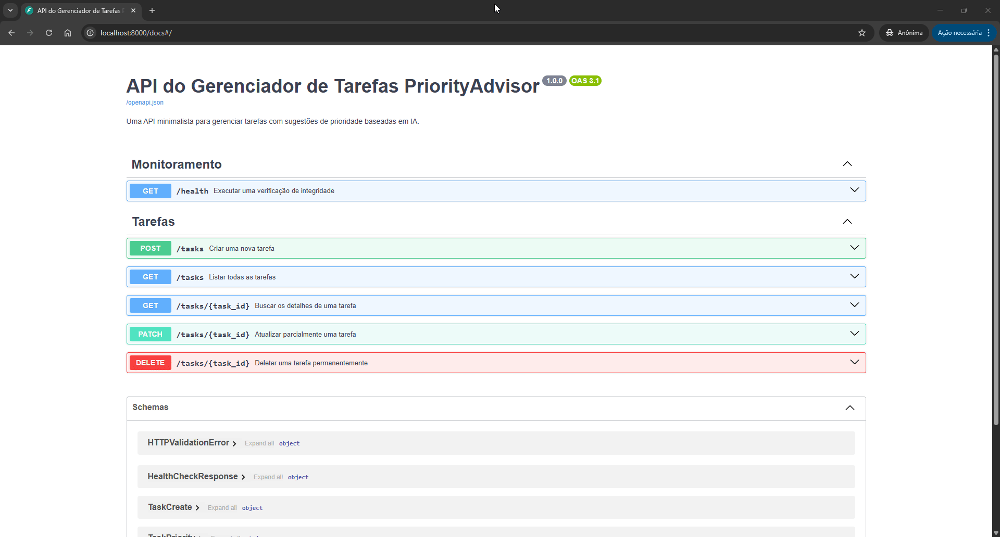

# 📋 Gerenciador de Tarefas (MVP)

API RESTful minimalista e resiliente para gerenciamento de tarefas (To-Do List), potencializada por Inteligência Artificial para sugestão automática de prioridades.

## 📑 Índice
* [Sobre o Projeto](#-sobre-o-projeto)
* [Destaques e Recursos](#-destaques-e-recursos)
* [Stack Tecnológica](#️-stack-tecnológica)
* [Como Executar (Zero-to-Hero)](#-como-executar-zero-to-hero)
* [Demonstração Prática (Showcase)](#-demonstração-prática-showcase)
* [Arquitetura (Clean Architecture)](#️-arquitetura-clean-architecture)
* [Testes e Qualidade (QA)](#-testes-e-qualidade-qa)
* [Roadmap de Releases](#-roadmap-de-releases)
* [Fora de Escopo](#-fora-de-escopo)
* [Licença](#-licença)

---

## 📋 Sobre o Projeto
Este projeto é um MVP construído com foco em **Developer Experience (DX)**, estabilidade e arquitetura limpa. Ele provê um CRUD de tarefas onde a prioridade pode ser delegada a uma Inteligência Artificial, sem prejudicar o tempo de resposta ou a dependência de infraestrutura externa complexa.

## ✨ Destaques e Recursos

* **IA Opcional (Fail-Safe & Fallback):** O sistema integra-se com a API do Google Gemini (OpenAI Compatible) via módulo `PriorityAdvisor`. **Rodar a LLM é totalmente opcional**. Se você não possuir uma API Key ou se a rede falhar, o sistema aplica um *fallback* local seguro de forma silenciosa, definindo a prioridade como "Média". O projeto roda offline sem custos!
* **Processamento Assíncrono:** A comunicação com a IA é orquestrada utilizando `BackgroundTasks` do FastAPI. Isso significa que a criação da tarefa (`POST /tasks`) é instantânea; a IA atualiza a prioridade no banco de dados "nos bastidores" de forma não bloqueante.

## 🛠️ Stack Tecnológica

* **Linguagem:** Python 3.12+
* **Framework Web:** FastAPI
* **Servidor ASGI:** Uvicorn
* **ORM e Banco de Dados:** SQLAlchemy & SQLite (Embutido)
* **Validação de Dados:** Pydantic
* **Automação:** Makefile
* **Testes & QA:** Pytest, HTTPX, pytest-asyncio, RESPX (Mocking)

## 🚀 Como Executar (Zero-to-Hero)

Siga os passos abaixo para configurar o ambiente local do zero em menos de 2 minutos. Não é necessário Docker ou banco de dados externo.

### 1. Pré-requisitos e Ambiente Virtual
Clone o repositório e crie o seu ambiente virtual Python (`.venv`):
```bash
git clone https://github.com/danilobress/mvp_todolist_akcit.git
cd mvp_todolist_akcit

# Windows
python -m venv .venv
.\.venv\Scripts\activate

# Linux/macOS
python3.12 -m venv .venv
source .venv/bin/activate
```

### 2. Variáveis de Ambiente (`.env`)
O projeto utiliza um arquivo `.env` para carregar as configurações locais da API de Inteligência Artificial.
Copie o arquivo de exemplo para criar o seu arquivo definitivo:
```bash
cp .env.example .env
```
*Dica: Você pode abrir o `.env` gerado e preencher `LLM_API_KEY` com sua chave do Google Gemini. Mas lembre-se: se deixar em branco, o sistema funcionará normalmente usando a heurística de fallback (sem IA).*

### 3. Setup Rápido (via Makefile)
Nós construímos um `Makefile` com atalhos para facilitar sua vida. 
Instale todas as dependências do projeto:
```bash
make install
```
*(Alternativa sem Makefile: `pip install -r requirements.txt`)*

### 4. Populando o Banco de Dados (Seed)
Para não ver um sistema vazio logo de cara, injete alguns dados de teste locais no SQLite:
```bash
make seed
```
*(Alternativa sem Makefile: `python seed_db.py`)*
*(Ou, se preferir reconstruir do zero via make, rode `make reset-db`)*

### 5. Rodando a Aplicação
Inicie o servidor de desenvolvimento:
```bash
make run
```
*(Alternativa sem Makefile: `uvicorn app.main:app --reload --port 8000`)*
Pronto! A documentação interativa (Swagger UI) está em: 👉 **http://localhost:8000/docs**

---

## 🎥 Demonstração Prática (Showcase)

Veja abaixo a API em ação, desde a inicialização até o gerenciamento completo das tarefas.

### 1. Inicializando a API e Swagger
O comando `make run` sobe o servidor instantaneamente, disponibilizando a documentação interativa.



### 2. Criando Tarefa com Inteligência Artificial
Ao enviar apenas título e descrição, a IA analisa o contexto em background e define a prioridade (Alta, Média ou Baixa) de forma assíncrona.



### 3. Listagem de Tarefas
Recuperação rápida de todas as tarefas persistidas no banco SQLite.


### 4. Edição de Tarefas
Atualização flexível de campos como título, descrição, status de conclusão ou prioridade.


### 5. Deleção de Tarefas
Remoção segura de registros do banco de dados.


---

## 🤖 Testando a IA na Prática (Exemplos)

Nossa arquitetura assíncrona garante que a requisição de criação da tarefa não fique aguardando a resposta da LLM. Teste os seguintes cenários pelo Swagger (`http://localhost:8000/docs`) ou via `curl` no seu terminal:

### Cenário 1: Sucesso (Com API Key configurada)
Envie um payload de emergência (POST `/tasks`):
```json
{
  "title": "Servidor de banco de dados caiu",
  "description": "Nenhum usuário consegue fazer login, erro 500 no site inteiro."
}
```
* **O que acontece:** A API retorna instantaneamente `201 Created` com a prioridade `"Média"`. Segundos depois, a rotina em background consulta o Gemini, identifica a urgência e atualiza silenciosamente o banco de dados.
* **Validação:** Dê um `GET /tasks` e veja que a prioridade da sua tarefa agora é `"Alta"`.

### Cenário 2: Resiliência e Fallback (Sem API Key ou Sem Internet)
Apague a sua `LLM_API_KEY` do arquivo `.env`, reinicie o servidor (`make run`) e envie uma nova tarefa (POST `/tasks`):
```json
{
  "title": "Atualizar README",
  "description": "Corrigir erro de digitação na linha 42"
}
```
* **O que acontece:** O sistema não quebra. O log do seu terminal exibirá o aviso de segurança:
`WARNING: LLM_API_KEY não configurada. Aplicando fallback silencioso 'Média'.`
* **Validação:** A tarefa é criada e mantida com a prioridade `"Média"` original, provando que o MVP roda 100% offline.

---

## 🏗️ Arquitetura (Clean Architecture)

O projeto adota rigorosamente o padrão arquitetural **Controller-Service-Repository**, garantindo separação de responsabilidades (SRP), alta testabilidade e baixo acoplamento:

* **Controller (Routers/Endpoints):** Camada de apresentação da API (`app/main.py`). Responsável exclusivamente por receber requisições HTTP, validar payloads de entrada via Pydantic e retornar respostas HTTP apropriadas.
* **Service (Lógica de Negócio):** O cérebro da aplicação. Orquestra validações complexas, delega tarefas em background e integra-se com o `PriorityAdvisor`.
* **Repository (Acesso a Dados):** Camada de persistência puramente dedicada à interação com o SQLAlchemy. Isola o banco SQLite da lógica de negócio, garantindo que uma futura migração para PostgreSQL exija mudanças estritamente isoladas.

🗺️ **Mapas Mentais e Diagramas:**
Para entender visualmente os contratos e a topologia, acesse nossos diagramas criados em Mermaid:
* [Visão de Rotas e Componentes](docs/component-diagram.mmd)
* [Visão Arquitetural e Fluxo de Banco de Dados](docs/api-diagram.mmd)

---

## 🧪 Testes e Qualidade (QA)

A meta de qualidade exige 100% de cobertura nos fluxos críticos. A suíte de testes foi projetada para ser rápida, determinística e isolada.

### Estratégia de Mocks e Banco em Memória
* **Isolamento de Banco:** Os testes não tocam no `tasks.db` de desenvolvimento. Utilizamos o *Dependency Overrides* do FastAPI (`app/tests/conftest.py`) para injetar transitoriamente um SQLite puramente em memória (`sqlite:///:memory:`).
* **Mocks de Rede:** A rede externa nunca é acessada durante a esteira de testes. As chamadas HTTP da IA são totalmente mockadas através do `respx`.

### Executando a Suíte
Execute todos os testes com um único comando do Makefile:
```bash
make test
```
*(Alternativa sem Makefile: `pytest -v`)*

---

## 🗺️ Roadmap de Releases e Próximos Passos (Limites Atuais)

Este MVP possui limites propositais para validar a integração com IA de forma ágil. Abaixo estão os limites atuais e os próximos passos mapeados:

### Limites Atuais (By Design)
* **Sem Autenticação (Limitação):** A API é totalmente pública. Não há conceito de "usuário" ou isolamento de tarefas por pessoa.
* **Banco Local (Limitação):** O uso do SQLite limita a escalabilidade horizontal (múltiplas instâncias do servidor).
* **Fila Simples (Limitação):** O `BackgroundTasks` roda em memória. Se o servidor desligar durante uma chamada à LLM, a tarefa perde a prioridade sugerida.

| Release | Foco | Objetivos Principais | Status |
| :--- | :--- | :--- | :--- |
| **v1.0 - Backend** | Estrutura & Persistência | Setup base, CRUD de Tarefas, isolamento Controller/Service/Repository, integração inicial com SQLite local e Integração da IA (PriorityAdvisor). | ✅ Concluído |
| **v1.1 - Qualidade** | Cobertura de Testes | Setup do Pytest, mocks com `respx` e testes do banco em memória. | ✅ Concluído |
| **v1.2 - Entrega Final** | Polimento & Documentação | Refatoração final, tipagem estrita (Mypy), linting (Ruff), automatizações (Makefile) e README final. | ✅ Concluído |
| **v2.0 - Próximo Passo** | Segurança e Mensageria | Implementar autenticação JWT, migrar para PostgreSQL e adotar Celery/Redis para filas resilientes. | ⏳ Planejado |

---

## 🚫 Fora de Escopo (Escopo Negativo)

Para alinhar expectativas e focar estritamente nos objetivos do MVP, os seguintes itens **NÃO** fazem parte desta entrega:

* **Frontend/GUI:** Nenhuma interface gráfica (Web, Mobile ou Desktop) será desenvolvida. A interação é exclusivamente via API REST.
* **Infraestrutura e Nuvem (Cloud/Docker):** O projeto foi desenhado para rodar localmente via `uvicorn` e automação em Makefile. Deployments em nuvem, orquestração com Docker/Kubernetes ou CI/CD pipelines não são necessários e não estão contemplados.
* **Bancos de Dados Externos:** O SQLite atende plenamente os requisitos. Não há suporte ou scripts de migração para PostgreSQL ou MySQL nesta fase.
* **Autenticação e Autorização:** Sistemas de login, tokens JWT ou gestão de usuários e papéis (RBAC) não estão contemplados. A API é aberta por design.

---

## 🤖 A Experiência de Construção com Inteligência Artificial

A construção deste MVP utilizou o **Google Gemini** como a inteligência central (GenAI) para acelerar a produtividade. A abordagem adotada substituiu a codificação puramente manual pela orquestração inteligente de prompts e curadoria de código. Todas as sugestões da IA foram revisadas de forma crítica com validação humana, garantindo que a lógica de negócios e as decisões de arquitetura tivessem uma abordagem humana e profissional, e não delegadas 100% à máquina.

### Pontos Positivos e Ganhos de Produtividade
* **Resolução de Problemas Complexos:** A IA foi fundamental na identificação e correção de problemas difíceis, como falhas de conexão de rede com a API da própria LLM externa, orientando no *debug* até chegarmos na estabilidade.
* **Autocorreção em QA:** Ao criar a complexa suíte de testes unitários e de integração, alguns erros ocorreram nas primeiras execuções. A IA conseguiu analisar os *logs* de erro (`pytest`) e se autocorrigir rapidamente para alcançar os 100% de cobertura (Green).
* **Expansão de Cobertura:** Quando o desenvolvimento identificou a necessidade de maior cobertura de testes para fluxos alternativos, a IA gerou agilmente novos cenários para garantir a qualidade do sistema.
* **Soluções Assertivas de BugFix:** Problemas pontuais, como a configuração inicial incorreta do `CORSMiddleware` no FastAPI, foram diagnosticados e corrigidos pela IA de forma precisa na primeira tentativa.

### Desafios e Ajustes Manuais Necessários
* **Necessidade de Refinamento de Prompts para Documentação:** Para que a documentação técnica saísse assertiva, o prompt inicial nunca bastou. Foi necessário podar, editar e iterar o *prompt* constantemente.
* **Iterações em Diagramas (Mermaid):** A geração dos diagramas arquiteturais e de componentes no Mermaid.js precisou de refinamento. A IA inicialmente gerou diagramas visualmente simples ou com erros de renderização. Foi preciso solicitar ajustes de design explícitos até alcançar o layout desejado.
* **Dificuldade em Comandos Compostos do Git:** A IA teve dificuldade em orquestrar múltiplos arquivos no `git commit` apenas com instruções verbais simples, exigindo comandos muito literais e detalhados por parte do usuário.
* **Ajustes de Modelagem:** Na criação da camada de `Repository`, um problema em um atributo mapeado pelo SQLAlchemy precisou de interferência e direcionamento manual para funcionar corretamente.
* **Padronização de Idioma:** A IA não manteve a consistência de idioma (inglês/português) nas mensagens de erro e respostas da API por padrão, demandando *prompts* corretivos para padronizar tudo.
* **Validações de Domínio (Vazamentos):** Durante o uso do endpoint `PATCH /tasks/{task_id}`, foi constatado que o sistema permitia qualquer *string* no campo prioridade. A IA não previu essa restrição sozinha no *schema* Pydantic inicial, exigindo a identificação do *bug* pelo usuário para que a validação de *Enum* (Alta/Média/Baixa) fosse implementada depois.

### Prompts que Funcionaram Melhor
* **Contexto Amplo e Explícito (CO-STAR):** Prompts que definiam explicitamente o papel (Role), o objetivo (Objective), os limites e o contexto do sistema em um formato estruturado trouxeram resultados com melhor qualidade nas iterações iniciais.
* **Correções baseadas em Logs Brutos:** Copiar e colar a stack trace de um erro do terminal com o comando direto "Analise este erro e sugira a correção" teve quase 100% de taxa de acerto nas correções de bugs.

### Riscos que Foram Mitigados
* **Exposição de Chaves (Segurança):** A IA previu a configuração do `pydantic-settings` para proteger a `LLM_API_KEY` usando o `.env`, mitigando o risco de expor credenciais no controle de versão (GitHub).
* **Corrupção de Dados em Testes (Isolamento):** Ao construir a suíte de testes, o risco dos testes automatizados sujarem o banco real do desenvolvedor foi mitigado pela implementação de `dependency overrides` com um banco em memória (`sqlite:///:memory:`).
* **Exaustão de Recursos de Rede (Performance):** A IA sugeriu e implementou o gerenciamento do HTTP Client (`httpx.AsyncClient`) atrelado ao ciclo de vida (Lifespan) do FastAPI. Isso evitou vazamento e exaustão de conexões (sockets).
* **Indisponibilidade da IA Externa (Resiliência):** O risco do sistema ficar fora do ar por lentidão ou queda no serviço da Google foi antecipado e mitigado pela lógica de _fallback local_ silencioso.

---

## 📄 Licença

Este projeto está sob a licença [MIT](LICENSE). Consulte o arquivo para obter mais detalhes.